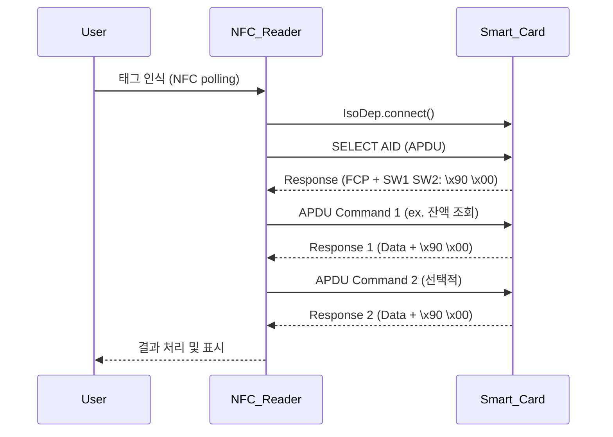

## Prologue


현재 프로젝트에서 안드로이드 NFC 를 연동하여 교통카드를 이용하는 기능


 [WebNFC](https://developer.mozilla.org/ko/docs/Web/API/Web_NFC_API) 를 연동해보기로 함


결론적으로 webNFC 에서 저수준 통신 프로토콜(IsoDep)을 지원하지않아 적용하지 못함


## webNFC


### webNFC 정의


브라우저(JavaScript)에서 NFC 태그에 접근하여 데이터를 읽고 쓸 수 있도록 해주는 웹 API.


### webNFC 주요 구성


주요 메서드:

- `NDEFReader.scan()`: 태그 스캔 시작
- `NDEFReader.write()`: 태그에 데이터 쓰기

이벤트:

- `onreading`: 태그를 읽었을 때 호출
- `onreadingerror`: 읽기 실패 시 호출

## NDEF (NFC Data Exchange Format)


### NDEF 정의


NFC 태그에 데이터를 저장하고 교환하기 위한 NFC Forum에서 정의한 표준 포맷


주로 **간단한 텍스트, URL, MIME 데이터** 등을 교환할 때 사용되는 고수준(High level) 프로토콜 


### NDEF 구성


```javascript
NDEF Message
└── NDEF Record 1 (ex: 텍스트 "Hello")
└── NDEF Record 2 (ex: URL "https://naver.com")
```

- **NDEF Message**: 여러 개의 `NDEF 레코드`로 구성됨
- **NDEF Record 종류 예시**:
	- 텍스트 (`text/plain`)
	- URL (`text/uri`)
	- MIME 타입 (`application/json`, `image/png`, 등)

### NDEF Record


_https://www.netes.com.tr/netes/dosyalar/dosya/B6159F60458582512B16EF1263ADE707.pdf_


| 필드                     | 설명                                                             |
| ---------------------- | -------------------------------------------------------------- |
| TNF (Type Name Format) | 데이터의 타입 (text, URI 등)                                          |
| Payload Type           | 데이터의 유형 (예: `T` = 텍스트, `U` = URL)                              |
| Payload ID (선택)        | 레코드 ID (잘 안 씀)                                                 |
| Payload Data           | 실제 데이터 (예: "Hello", "[https://naver.com](https://naver.com/)") |


<div class="callout" style="display:flex;width:100%;border-radius:4px;background:rgb(241,241,239);padding: 16px 16px 16px 12px;">
<div style="display:flex;align-items:center;justify-content:center;height:24px;width:24px;border-radius:0.25em;flex-shrink:0;">💡</div>
<div style="white-space:pre-wrap;word-break:break-word;caret-color:rgb(55, 53, 47);margin-left:8px;padding-left:2px;padding-right:2px;">기타 자세한 설명은 <a href="https://www.netes.com.tr/netes/dosyalar/dosya/B6159F60458582512B16EF1263ADE707.pdf" target="_blank">링크</a>를 참고할 것…</div>
</div>


하지만 실제 카드 NFC 데이터를 읽어보니 아무 정보도 나오지가 않아서 기존 코드를 참고


webNFC에서는 지원하지 않는 IsoDep라는 저수준 프로토콜을 이용하여 통신


## IsoDep (ISO 14443-4)


스마트카드와 유사한 방식으로 APDU 커맨드를 주고받는 저수준(Low level) 통신 방식


APDU (Application Protocol Data Unit)를 사용해 통신


<div class="callout" style="display:flex;width:100%;border-radius:4px;background:rgb(241,241,239);padding: 16px 16px 16px 12px;">
<div style="display:flex;align-items:center;justify-content:center;height:24px;width:24px;border-radius:0.25em;flex-shrink:0;">💡</div>
<div style="white-space:pre-wrap;word-break:break-word;caret-color:rgb(55, 53, 47);margin-left:8px;padding-left:2px;padding-right:2px;"></div>
</div>


## 동작순서




1. Connect
2. App 선택 (SELECT AID)
3. Card 에서 해당 App 선택 후 Response
4. Response 검증
5. 데이터 통신

### Sudo-code


```javascript
isoDep.get(tag)

isoDep.transceive(APDU.SELECT_APP)

validateResponse()

isoDep.transceive(APDU.READ_CARD_INFO)

bytesToHex(byte[])

```


<div class="callout" style="display:flex;width:100%;border-radius:4px;background:rgb(241,241,239);padding: 16px 16px 16px 12px;">
<div style="display:flex;align-items:center;justify-content:center;height:24px;width:24px;border-radius:0.25em;flex-shrink:0;">💡</div>
<div style="white-space:pre-wrap;word-break:break-word;caret-color:rgb(55, 53, 47);margin-left:8px;padding-left:2px;padding-right:2px;"><strong>FCP (File Control Parameters)</strong></div>
</div>

