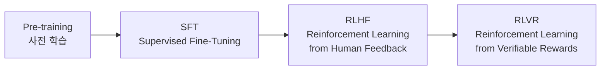

대규모 언어 모델(LLM)은 단순히 데이터 규모만으로 완성되지 않는다.
실제 서비스에 사용되는 LLM은 여러 단계의 학습 파이프라인을 거쳐 점진적으로 성능이 개선된다.

대표적인 흐름은 다음과 같다.

Pre-training
  → SFT (Supervised Fine-Tuning)
    → RLHF (Reinforcement Learning from Human Feedback)
      → RLVR (Reinforcement Learning from Verifiable Rewards)

---

## 1. 사전 학습 (Pre-training)

### 언어 모델의 기본기

사전 학습은 LLM의 언어 이해 능력과 일반 지식을 형성하는 단계다.
대규모 코퍼스를 기반으로 다음 토큰을 예측하는 방식으로 학습한다.

모델은 이 단계에서 다음을 학습한다.

- 문법과 어휘
- 문맥 기반 의미 이해
- 일반 상식
- 다양한 도메인의 텍스트 패턴

한계점도 명확하다.

- 질문 의도를 고려하지 않는다
- 대화용으로는 응답이 거칠다
- 유해하거나 부정확한 답변 가능성이 존재한다

이 때문에 이후 단계에서 정제 과정이 필요하다.

---

## 2. SFT (Supervised Fine-Tuning)

### 질문-응답 포맷 학습

SFT는 사람이 작성한 고품질 질문-답변 데이터로 모델을 미세조정하는 단계다.

이 단계의 핵심 목적은 다음과 같다.

- Instruction Following 능력 강화
- 출력 형식 안정화
- 기본적인 안전성 확보

모델은 이제 "무엇을 어떻게 답해야 하는지"를 학습하지만,
여전히 여러 응답 중 어떤 것이 더 좋은지는 명확히 알지 못한다.

---

## 3. RLHF (Reinforcement Learning from Human Feedback)

### 인간 선호 기반 강화 학습

RLHF는 인간 평가를 보상으로 사용하는 강화 학습 방식이다.

일반적인 흐름은 다음과 같다.

1. 모델이 동일한 프롬프트에 대해 여러 응답 생성
2. 사람이 응답들을 비교 및 랭킹
3. 인간 평가로 Reward Model 학습
4. Reward를 최대화하도록 LLM 강화 학습

장점:

- 사용자에게 유용한 답변 학습
- 톤, 매너, 안전성 개선
- 실제 서비스 품질 향상

단점:

- 사람 라벨링 비용이 큼
- 평가 기준이 주관적
- 수학, 코딩처럼 정답이 명확한 문제에는 비효율적

이 한계를 보완하기 위해 RLVR이 등장한다.

---

## 4. RLVR (Reinforcement Learning from Verifiable Rewards)

### 검증 가능한 보상 기반 학습

RLVR은 사람이 아닌, 검증 가능한 결과를 보상으로 사용하는 강화 학습이다.

보상의 기준은 명확하다.

- 수학 문제: 최종 답 일치 여부
- 코딩 문제: 테스트 통과 여부
- 논리 문제: 조건 만족 여부

이 방식의 장점은 다음과 같다.

- 자동 채점 가능
- 대규모 확장 용이
- 주관성 제거
- 추론 및 정확도 향상에 효과적

특히 다음 영역에서 강력하다.

- 수학적 추론
- 코드 생성 및 디버깅
- 멀티 스텝 문제 해결

---

## 전체 파이프라인 요약

단계별 역할은 다음과 같다.

Pre-training  : 언어와 지식의 기반 형성

SFT           : 질문에 맞게 답하는 능력 학습

RLHF          : 인간이 선호하는 답변 최적화

RLVR          : 정답이 명확한 문제에서 정확성 극대화

---

## 마무리

현대 LLM은 단일 학습 방식으로 만들어지지 않는다.

사전 학습으로 세상의 언어를 배우고,
SFT로 질문에 답하는 법을 익히며,
RLHF로 사람의 기대를 반영하고,
RLVR로 정확한 추론 능력을 완성한다.

