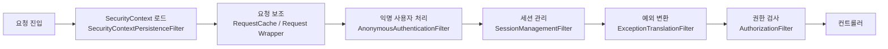

### DisableEncodeUrlFilter

- URL에 `jsessionid`가 붙지 않도록 URL 인코딩을 막는 필터
- 세션 ID 노출로 인한 보안 문제를 예방

### WebAsyncManagerIntegrationFilter

- 비동기 요청 처리 시에도 `SecurityContext`를 유지
- 스레드가 변경되어도 인증 정보 접근 가능하게 해줌

### SecurityContextPersistenceFilter

- 요청 시작 시 세션에서 `SecurityContext`를 꺼내고
- 요청 종료 시 변경된 `SecurityContext`를 다시 세션에 저장
- 인증 정보 관리의 중심 역할

### HeaderWriterFilter

- 보안 강화를 위한 Spring Security 관련 HTTP 응답 헤더 추가
- 클릭재킹, XSS, MIME 타입 공격 등 방어 목적

### LogoutFilter

- 로그아웃 URL 요청을 감지해 로그아웃 처리
- 세션 무효화, 인증 정보 삭제, 쿠키 제거 수행

### RequestCacheAwareFilte

- 인증되지 않은 사용자의 요청을 저장
- 로그인 성공 후 이전에 요청했던 페이지로 이동 처리

### SecurityContextHolderAwareRequestFilter

- `HttpServletRequest`를 감싸 인증 관련 편의 메서드 제공
- 컨트롤러에서 사용자/권한 정보 접근을 쉽게 해줌

### AnonymousAuthenticationFilter

- 인증되지 않은 요청에 대해 익명 사용자(`AnonymousAuthentication`)를 생성
- 모든 요청이 인증 객체를 갖도록 보장

### SessionManagementFilter

- 인증된 사용자와 관련된 세션 관리 수행
- 세션 고정 공격 방지, 유효하지 않은 세션 처리

### ExceptionTranslationFilter

- 인증/인가 과정에서 발생한 예외를 처리
- 로그인 페이지 이동 또는 403 응답 등으로 변환

### AuthorizationFilter

- URL 기준으로 사용자의 접근 권한을 검사
- 실제 리소스 접근을 허용/차단하는 인가 필터
