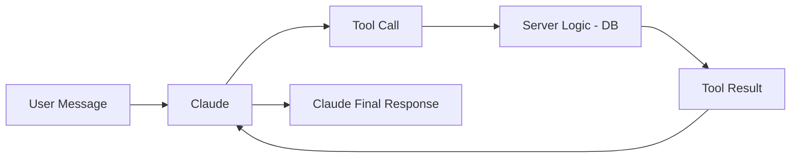
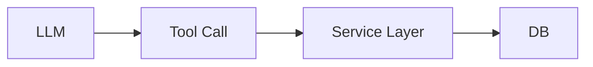

테니스 동호회 서비스를 만들면서 **자연어로 일정 생성 / 조회가 되는 챗봇**을 붙였다.


예시


```text
"다음주 토요일 2시에 번개 만들어줘"
"이번달 일정 뭐 있어?"
"코트 목록 보여줘"
```


Claude의 **Tool Use** 기능을 사용하면


이런 자연어 요청을 실제 서버 로직(DB 작업)으로 연결할 수 있다.


구조는 단순하다.





---


# Tool 정의


Claude가 사용할 수 있는 기능을 **JSON schema**로 정의한다.


예: 일정 생성


```typescript
export const chatTools:Anthropic.Tool[]= [
  {
    name:'create_event',
    description:'테니스 일정 생성',
    input_schema: {
      type:'object',
      properties: {
        title: { type:'string' },
        start_datetime: { type:'string' },
        end_datetime: { type:'string' },
        location_name: { type:'string' },
        location_url: { type:'string' },
        max_participants: { type:'number' },
        description: { type:'string' },
      },
      required: ['title','start_datetime','end_datetime','max_participants'],
    },
  },
]
```


핵심 포인트

- 날짜는 **ISO 8601**
- 필수 값은 **required**
- 나머지는 서버에서 보정

---


# System Prompt


챗봇의 역할과 규칙 정의


```typescript
const SYSTEM_PROMPT=`
테니스 동호회 AI 어시스턴트입니다.

규칙
- 한국 시간(KST)
- 현재 연도 2026
- 종료 시간 미지정 → +2시간
- 최대 인원 미지정 → 8명
- 일정 생성 후 요약 출력
`
```


여기서 **운영 규칙을 고정**한다.


---


# Tool 실행


Claude가 tool_use를 요청하면


서버에서 실제 로직을 실행한다.


```typescript
async function executeToolCall(toolName,toolInput,hostMemberSeq) {
	switch (toolName) {
		case'create_event':
			const event = awaitwriteEvent({
			        ...toolInput,
			        host_member_seq: hostMemberSeq,
			      })
			return JSON.stringify({
			        success: true,
			        event_id: event.id,
			      })
		case'get_events':
			const result = awaitgetEventList(1,50,toolInput)
			return JSON.stringify(result)
  }
}
```


핵심





기존 서비스 로직을 그대로 사용한다.


---


# Tool Use 루프


Claude는 한 번에 끝나지 않고


**tool_use → tool_result → 재호출**이 가능하다.


그래서 루프 구조로 처리한다.


```typescript
while (continueLoop) {
	const response = await anthropic.messages.create(...)
	
	if (response.stop_reason === 'tool_use') {
		// tool 실행
		constresult = awaitexecuteToolCall(...)
		
		// tool_result 전달
		messages.push({
		      role: 'user',
		      content: [{ type:'tool_result', content:result }],
		    })
	} else {
		// 최종 응답
		continueLoop = false
  }
}
```


---


# SSE 스트리밍


응답은 **Server Sent Events**로 전송한다.


프론트에서 상태를 보여줄 수 있도록 이벤트를 정의하여 처리


`text`, `tool_start` , `tool_end`, `done`, `error`


예


```typescript
controller.enqueue(
	encoder.encode(
	`data:${JSON.stringify({
      type:'tool_start',
      tool:block.name,
    })}\n\n`
  )
)
```


---

