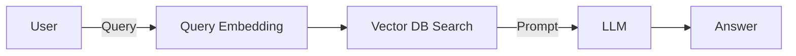
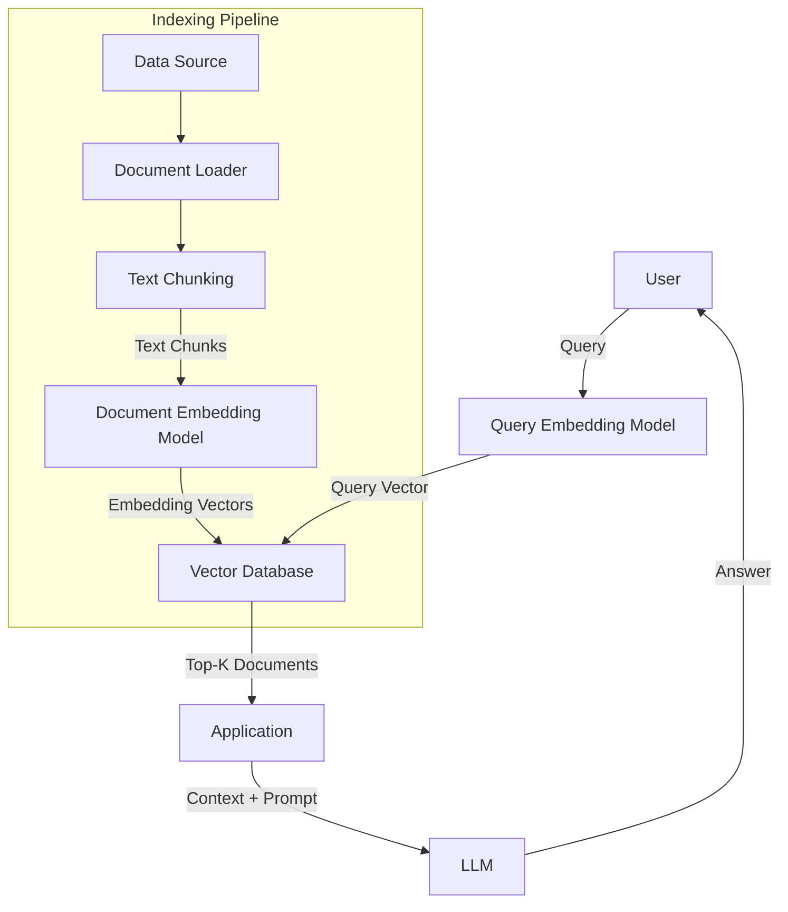
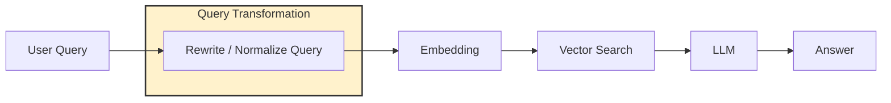
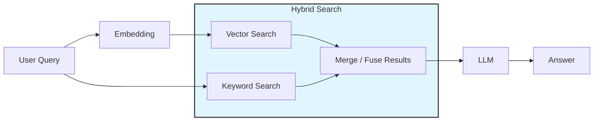
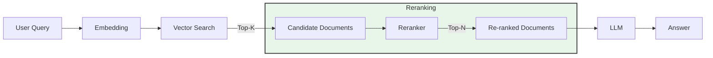
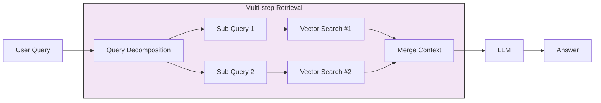
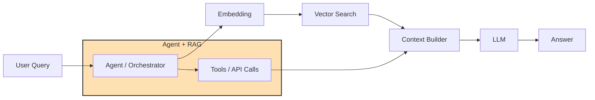

이제는 여기저기 기본 구조로 자리잡은 RAG에 대해 정리 겸 글을 작성해보려고 한다.

요즘은 Agent + RAG를 함께 사용하는 듯 하다.

## 정의

대형 언어 모델(LLM)이 외부 데이터 소스에서 관련 정보를 검색하고, 해당 정보를 활용하여 보다 정확한 답변을 생성하도록 하는 AI 아키텍처

---

## 필요성

- **확장성:** 최신 정보나 외부 데이터를 실시간으로 검색하여 활용 가능
- **유연성:** Vector DB 데이터를 업데이트하여 시스템을 쉽게 확장 가능
- **정확성:** 검색된 문서를 기반으로 답변을 생성하기 때문에 Hallucination 최소화

---

## 핵심 용어 정리

- **Query :** 사용자가 시스템에 입력하는 질문 또는 요청을 의미
- **Embedding :** 텍스트의 의미를 숫자 벡터 형태로 변환한 표현. 이를 통해 의미 기반 검색이 가능함
- **Vector DB :** Embedding Vector를 저장. 벡터 간 유사도를 기반으로 관련 문서를 검색하는 DB
- **Top-K Documents :** 검색된 문서(청크) 중 상위 K개를 선택하는 파라미터
- **Context :** Prompt의 구성요소로 검색된 문서들을 LLM에게 제공하기 위해 정리한 정보.
- **Prompt :** 사용자 질문과 Context를 함께 포함하여 LLM에게 전달되는 입력 텍스트
- **LLM (Large Language Model) :** 자연어를 이해하고 텍스트를 생성하는 대규모 언어 모델

---

## 기본 동작 개념

단계를 좀 더 세부적으로 나누자면 “검색 단계” 와 “생성 단계”로 구분 할 수 있다.

### 검색 단계(Retrieval)

| 세부단계                         | 설명                             | 처리 주체           | 예시                                 |
| ---------------------------- | ------------------------------ | --------------- | ---------------------------------- |
| **User Query**               | 사용자가 AI 시스템에 질문을 입력            | 사용자             | "환불 정책이 어떻게 되나요?"                  |
| **Query Embedding**          | 질문을 Embedding 모델을 통해 벡터 형태로 변환 | Embedding Model | "환불 정책" → [0.21, -0.53, 0.78, ...] |
| **Vector DB Search**         | 질문 벡터와 유사한 문서를 Vector DB에서 검색  | Vector DB       | 환불 정책 관련 문서 검색                     |
| **Top-K Document Retrieval** | 검색된 문서 중 가장 관련성이 높은 문서를 선택     | Retriever       | “환불 정책은 구매 후 7일 이내 가능합니다.”         |

### 생성 단계(Generation)

| 세부단계           | 설명                                     | 처리 주체       | 예시                       |
| -------------- | -------------------------------------- | ----------- | ------------------------ |
| **Context 구성** | 검색된 문서를 하나의 context로 정리                | Application | 환불 정책 관련 문서 묶음           |
| **Prompt 생성**  | 사용자 질문과 context를 결합하여 LLM에 전달할 프롬프트 구성 | Application | “다음 문서를 참고하여 질문에 답하세요.”  |
| **답변 생성**      | LLM이 context를 기반으로 답변을 생성              | LLM         | 환불 정책 설명 생성              |
| **Answer 반환**  | 생성된 답변을 사용자에게 전달                       | Application | “환불은 구매 후 7일 이내에 가능합니다.” |

이제 RAG가 어떻게 사용되는지 이해했다면,

다음으로는 RAG를 구축하는 관점에서 **“VectorDB의 데이터를 어떻게 준비”**하는지 좀 더 이해해보자.

---

## RAG Architecture

RAG 시스템은 크게 **데이터를 준비하는 과정(Indexing Pipeline)**과 **사용자의 질문을 처리하는 과정(Retrieval Pipeline)**으로 나눌 수 있습니다.

- **준비 과정(Indexing Pipeline)** : 문서를 검색 가능하도록 준비하는 단계
- **검색 과정(Retrieval Pipeline)** : 사용자 질문에 대한 답변을 생성하는 단계

준비과정(Indexing Pipeline)을 통해 다양한 데이터 소스를 가공하여 Vector DB에 저장하게 됩니다.

이렇게 저장된 데이터는 이후 사용자의 질문이 들어왔을 때 유사도 검색을 통해 관련 문서를 빠르게 찾는 데 사용됩니다.

### Overview

.md/0.png)_image.png_

### Indexing Pipeline

Indexing Pipeline은 다양한 데이터 소스를 가공하여 **Vector DB에 저장하는 과정**입니다.

이 과정은 **사용자가 질의하기 전에 사전에 수행**됩니다.

| 세부 단계               | 설명                                  | 처리 주체           | 예시                               |
| ------------------- | ----------------------------------- | --------------- | -------------------------------- |
| **Data Source**     | RAG 시스템에서 활용할 원본 데이터를 준비            | 외부 데이터 소스       | PDF, 문서, 위키, 웹페이지                |
| **Document Loader** | 다양한 형식의 데이터를 읽어와 텍스트 형태로 변환         | Application     | PDF → 텍스트                        |
| **Text Chunking**   | 긴 문서를 검색 효율을 위해 작은 단위로 분할           | Application     | 문서를 500~1000 token 단위로 분할        |
| **Embedding 생성**    | 각 텍스트 Chunk를 벡터로 변환                 | Embedding Model | `"환불 정책"` → `[0.21, -0.53, ...]` |
| **Vector 저장**       | 생성된 Embedding Vector를 Vector DB에 저장 | Vector Database | 문서 벡터 인덱싱                        |

### **Retrieval** Pipeline

Retrieval Pipeline은 사용자의 질문을 처리하여 **관련 문서를 검색하고 답변을 생성하는 과정**입니다.

| 세부 단계               | 설명                                  | 처리 주체                 | 예시                               |
| ------------------- | ----------------------------------- | --------------------- | -------------------------------- |
| **User Query**      | 사용자가 시스템에 질문을 입력                    | 사용자                   | “환불 정책이 어떻게 되나요?”                |
| **Query Embedding** | 질문을 벡터로 변환                          | Embedding Model       | `"환불 정책"` → `[0.18, -0.44, ...]` |
| **Vector Search**   | 질문 벡터와 유사한 문서를 Vector DB에서 검색       | Vector Database       | 환불 관련 문서 검색                      |
| **Top-K Retrieval** | 관련성이 높은 상위 K개의 문서를 선택               | Retriever / Vector DB | 환불 정책 관련 문서 3개                   |
| **Prompt 생성**       | 검색된 문서(Context)와 질문을 결합하여 LLM 입력 생성 | Application           | “다음 문서를 참고하여 질문에 답하세요.”          |
| **Answer 생성**       | LLM이 Prompt를 기반으로 답변 생성             | LLM                   | “환불은 구매 후 7일 이내 가능합니다.”          |
| **Answer 반환**       | 생성된 답변을 사용자에게 전달                    | Application           | 사용자에게 응답 표시                      |

---

## RAG 2.0 (Advanced RAG)

기본적인 RAG 구조는 **Vector DB 검색 + LLM 생성**이라는 단순한 형태로 시작했지만, 실제 서비스에서는 더 높은 정확도와 복잡한 질의를 처리하기 위해 다양한 개선 기법들이 등장했습니다.

이러한 발전된 구조를 **RAG 2.0** 또는 **Advanced RAG**라고 부릅니다. (업계 표준정도..de factor)

발전된 RAG에는 다음과 같은 추가 단계들이 포함됩니다.

### Query Transformation

사용자의 질문을 그대로 검색하는 대신 **검색에 더 적합한 형태로 변환**합니다.

예:

이 과정은 LLM을 이용하여 수행하기도 합니다.

### Hybrid Search

Vector Search만 사용하는 대신 **Keyword Search + Vector Search를 함께 사용**합니다.

이 방식은 특히 다음 상황에서 유리합니다.

- 정확한 키워드가 중요한 문서
- 코드 검색
- 로그 검색

### Reranking

Vector Search로 가져온 Top-K 문서를 **다시 한 번 정렬**합니다.

이 과정에서 **Cross-Encoder 모델**이 사용되기도 합니다.

### Multi-step Retrieval

복잡한 질문의 경우 한 번의 검색으로 충분하지 않을 수 있습니다.

이 경우 검색을 여러번하여 사용합니다.

### Tool / Agent Integration

최근에는 **Agent와 RAG를 결합하는 구조**가 많이 사용됩니다.

Agent는 다음과 같은 역할을 수행합니다.

- 검색 전략 결정
- 여러 데이터 소스 호출
- Tool 사용 (API / DB)

---

# RAG 1.0 vs RAG 2.0

| 구분       | RAG 1.0       | RAG 2.0                       |
| -------- | ------------- | ----------------------------- |
| 검색       | Vector Search | Hybrid / Multi-step Retrieval |
| Query 처리 | 단순 Query      | Query Rewrite / Decomposition |
| 문서 선택    | Top-K         | Reranking                     |
| 구조       | 단일 파이프라인      | Agent + RAG                   |
| 활용       | 간단한 QA        | 복잡한 지식 시스템                    |

